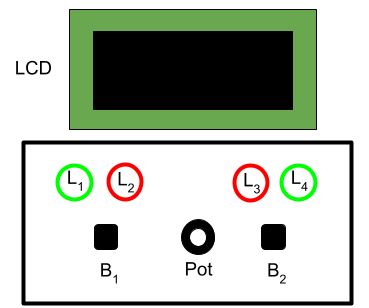

### Embedded Systems and IoT  - ISI LT - a.y. 2025/2026

## Assignment #01 - *React!* 

v. 1.0.0-20261006
 
We want to realise an embedded system implementing a game called *React!*. 

### Description 

The game board includes two green leds (L1, L3), two red leds (L2, L4), two tactile buttons B1, B2, a potentiometer Pot, and an LCD. This is the suggested  layout:

*React!* is a two players game. Each player uses a button: player #1 button B1, player #2 button #2. A game proceeds by rounds. At each round, the system  displays on the LCD - at a random time - a integer number N between 1 and 3 (i.e., either 1 or 2 or 3). Each player must react as fast as possible, pressing her/his button N times. For instance: if N is 2, then players must press 2 times their buttons.  The player who does it first wins the round. In that case, a green led (L1 for player #1, L4 for player #2) is turned on for 2 seconds, and she/he gets a point, increasing her/his score by 1. If a player presses the button before the number N is displayed, the red led is turned on for 2 seconds and her/his score is decreased by 1. This penalty occurs also if a player presses her/his button more times than N. If no players reacts within some timeout T1 (a parameter of the program), then both red leds are turned on for 2 seconds, and the game ends (game over). At each round, the time T1 is reduced of some factor F. The game goes on round after round, until game over.  At game over, the player with the highest score wins (but tie case).  

**Game behaviour in detail**

- In the initial state, all green leds should be off and red led L2 and L3 should be pulsing (fading in and out) in counterphase (when L2 is fading in, L3 should be fading out and viceversa), waiting for two players to start the game.  The LCD should display the message   `Welcome to the React! Game. Press Buttons to Start` on a single line. The message should be animated, displaying only a substring of a size limited to the display line length and rotating, continuously. 

- The game starts when both button B1 and the button B2 are pressed.  If the buttons are not pressed within 10 seconds, the system must go into deep sleeping. The system can be awoken back  by pressing either B1 or B2 button. Once awoken, the system goes in the initial state and the led Ls starts pulsing again.  When the game starts, all leds are turned off and a `Go!` message is displayed on the LCD. The score of both players is set to zero.

- During the game, at each round:
  - The leds are turned off and, the LCD cleared, and after a random amount of time between 0 and MAX_WAIT milliseconds (another parameter, e.g. 5000), a  number N between 1 and 3 is displayed on the LCD.
  - Then, players has max T1 time for reacting and pressing their buttons N times
  - The first player who presses the button for N times wins the round
    - her/his green led (L1 for player #1, L4 for player #2) is turned on for 2 seconds and her/his score is incremenented by one.
  - If a player presses the button too early (before the number N is displayed) or a wrong number of times, then her/his red led (L2 for player #1, L3 for player #2) is turned on for 2 seconds and her/his score is decremented by one. 
  - If no players press their button within T1 seconds, then the game ends. If there is a winner (no tie), a message `Game Over - The winner is XX` (where `XX` is either 'P1' or 'P2') is displayed on the LCD (string animated, rotating) for 10 seconds, then the game restarts from the initial state. In the case of tie, the message `Game Over - Tie` is displayed instead.
 
- At the end of each round (but in case of game over), while the green or red leds are turned on, players' score is displayed on the LCD (e.g with one score aligned left and one aligned right).

- Every new round the time T1 is reduced of some factor F (parameter of the program), that depends on a difficulty level L chosen players before starting the game, using the Pot device. In particular, the level L could be a value in the range 1..4 (1 easiest, 4 most difficult). The level affects the value of the factor F (so that the more difficult the game is, the greater the factor F must be). 

### The assignment

Develop the game on an MCU-based platform (e.g. Arduino), implementing the embedded software using athe Wiring framework. Requirements:
- The game must be based on a super-loop control architecture.
- A procedural programming style should be adopted  (i.e. not object-oriented, that will be part of assignment #02) 
- you can choose concrete values for all parameters (T1, F, MAX_WAIT) in order to have the best game play. 

For any other aspect not specified, make the choice that you consider most appropriate.

The deliverable must a zipped folder `assignment-01.zip` including two subfolders:
- `src` 
  - including the Arduino project source code
- `doc` including:
  - a representation of the schema/breadboard using tools such as TinkerCad or Fritzing or Eagle or others. 
  - a short video (or the link to a video on the cloud) demonstrating the system.
